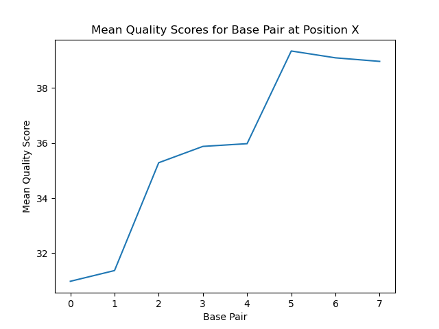
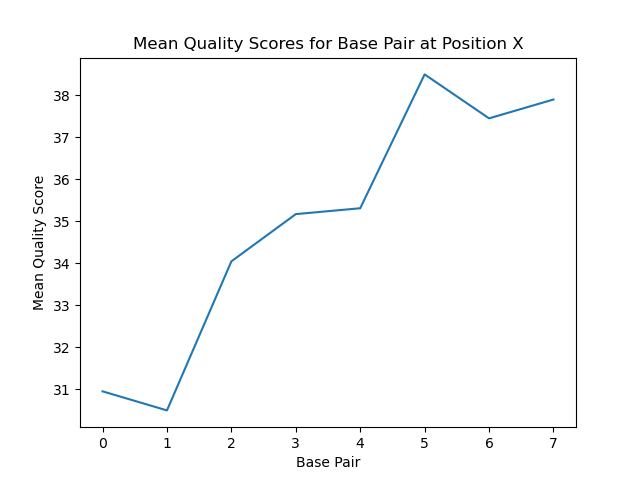
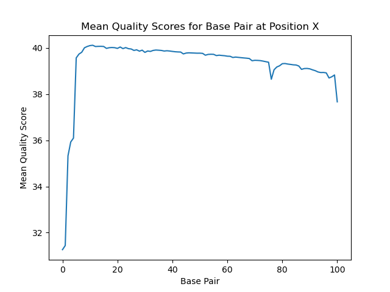
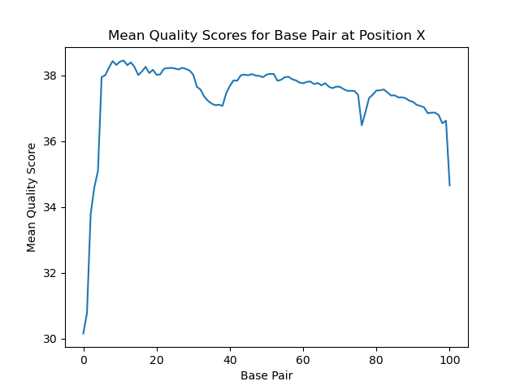

# Assignment the First

## Part 1
1. Be sure to upload your Python script. Provide a link to it here:
[dist_qscores.py](../dist_qscore.py)

| File name | label | Read length | Phred encoding |
|---|---|---|---|
| 1294_S1_L008_R1_001.fastq.gz | read1 | 101 | +33 |
| 1294_S1_L008_R2_001.fastq.gz | index1 | 8 | +33 |
| 1294_S1_L008_R3_001.fastq.gz | index2 | 8 | +33 |
| 1294_S1_L008_R4_001.fastq.gz | read2 | 101 | +33 |

2. Per-base NT distribution
    Use markdown to insert your 4 histograms here.
    
    
    
    
    
## Part 2
1. Define the problem

The problem for de-multiplexing is that the 4 intitial read files that are given contain reads from 24 seperate cell lines which were each prepped with different barcodes. The goal is to take these 4 files and output 52 files. 2 unknown (FW and RV reads in which the index aka barcode is either not in the barcde library OR is too low of a qual score) - 2 unmatched (FW and RV reads in which the indexes ARE in the library but do not match indicating that index hopping occured) - and 48 matched files (24 FW reads for each indes and 24 RV reads for each index)

2. Describe output

52 files. 2 unknown (FW and RV reads in which the index aka barcode is either not in the barcde library OR is too low of a qual score) - 2 unmatched (FW and RV reads in which the indexes ARE in the library but do not match indicating that index hopping occured) - and 48 matched files (24 FW reads for each indes and 24 RV reads for each index)

3. Upload your unit test files: 

[TEST-input_FASTQ](../TEST-input_FASTQ)

[Test-output-FASTQ](../TEST-output_FASTQ).

4. Pseudocode:

[Pseudcode](pseudo_code_pt2.txt)

5. High level functions. For each function, be sure to include:
    1. Description/doc string
    2. Function headers (name and parameters)
    3. Test examples for individual functions
    4. Return statement

```
def rev_compliment:
"this function will reverse compliment a DNA seq and output the correspondig seq as a string"

take in STRING 
for each index pos of the string:
    string.upper()
    string.replace(A, T)
    string.replace(T, A)
    string.replace(C, G)
    string.replace(G, C)

return(string)
```
```
def:append_index_head
"this function will append both indexes to the END of a header"
input: take in 3 strings (header, index 1, index 2)
return(header + index1 + index2)
```
```
def: avg_qscore (PS4)
"a function to get the MEAN q score for an entire READ"
input: quality socres : str
    use convert phred and mean the entire read 
    return(mean q score of read)
```


2.	What is a good quality score cutoff for index reads and biological read pairs to utilize for sample identification and downstream analysis, respectively? Justify your answer.

I am going to use 35 as my quality score cut off. I will be cutting off in based on the AVERAGE quality score of the index line rather than the per base quality score. I decided on 35 as my quality score cut off because it is the rough mean of the means of each index position. 

35 also represents a 0.00032 error rate meaning that I can be 99.99968% confident that a read with an average score of 35 is error free. I've decided on such a stringent quality score requirement becuase the consequences assocuated with accidently including a low quality score is much more than the risk of not ending up with enough high quality data, especially with a data set this large. 


3.	How many indexes have undetermined (N) base calls? (Utilize your command line tool knowledge. Submit the command(s) you used. CHALLENGE: use a one-line command
```
$zcat 1294_S1_L008_R2_001.fastq.gz | sed -n '2 ~ 4p' | grep -c "N"
3976613
```
```
zcat 1294_S1_L008_R3_001.fastq.gz | sed -n '2 ~ 4p' | grep -c "N"
3328051
```
